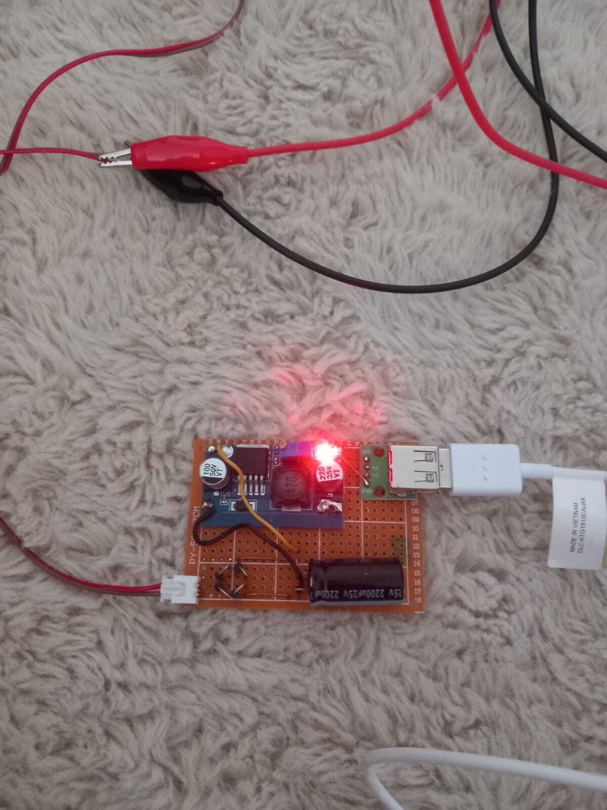
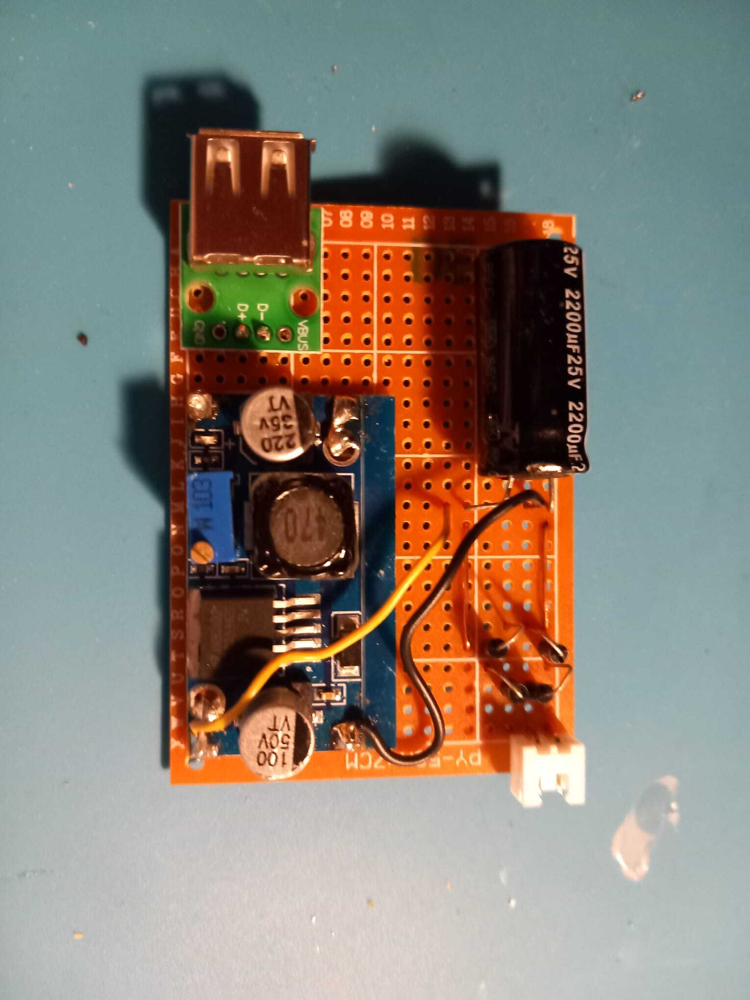
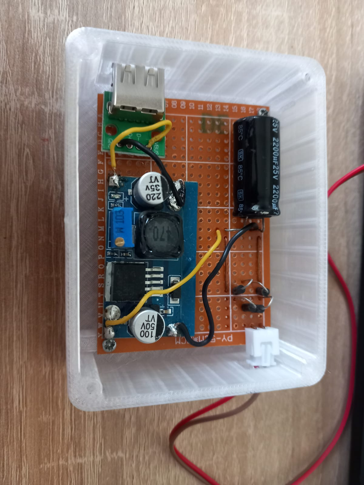
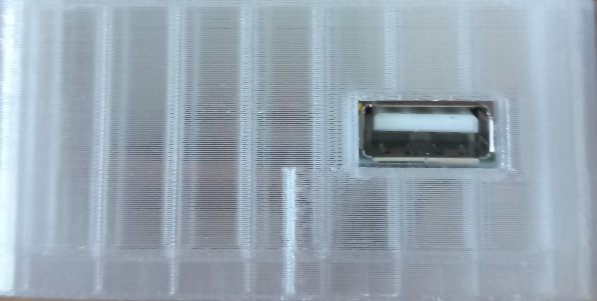

# 5V USB Charger Powered by Dynamo

This project focuses on the development of a 5V USB charger powered by a dynamo. The goal is to create a portable and efficient charger that harnesses kinetic energy, such as from a bicycle dynamo.

## Current Status

The project is still in development. The 3D models are not yet perfectly aligned with the PCB, which has resulted in the charger not being fully functional at this stage. However, initial tests have been conducted, showing that the PCB successfully charges at speeds up to 9 km/h. Unfortunately, the device has not yet been able to charge at speeds above 9 km/h.

## Next Steps

I will continue to work on improving the functionality of the charger, particularly focusing on enabling charging at speeds above 9 km/h. Once this issue is resolved, I plan to update the 3D models accordingly and release a YouTube video with a detailed tutorial on my channel.

## Images and Progress

Despite the current challenges, I have taken some images showing the PCB's functionality at speeds up to 9 km/h. These images are available in this repository.

## Future Outlook

The goal is to provide a fully functional version of the charger in the near future. All relevant files, including the updated 3D models, will be published in this repository once development is complete.
